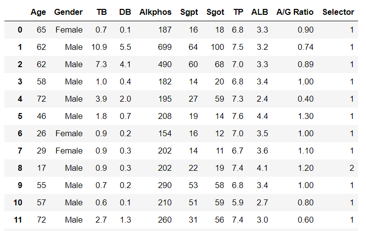
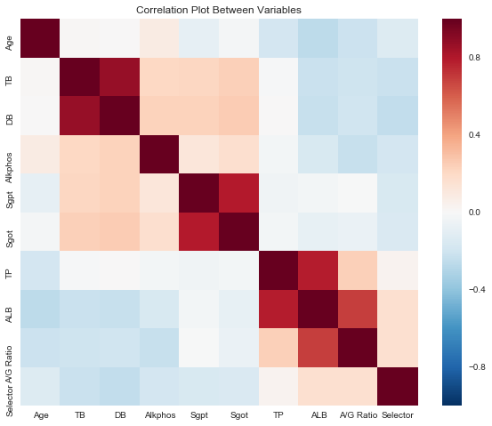
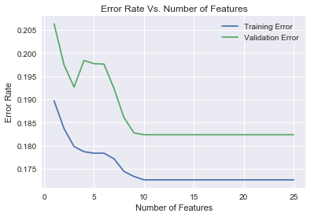
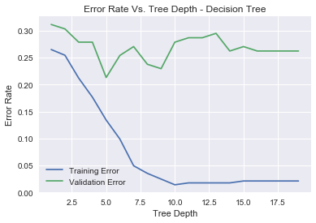
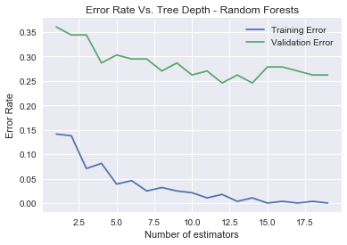
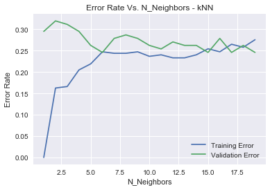

Indian Liver Patient Classification
================

Introduction
------------

Advances in machine learning have allowed medical professionals to predict patient outcomes and classify patients with significant accuracy. It is certain that anyone aspiring to pursure a career in the medical field should familiarize themselves with these tools. The goal of this project is the explore the use of feature and model selection on an interesting dataset.

The dataset consists of 583 instances, 10 attributes and no missing values. There are 416 liver patient records and 167 non-liver patient records, which have been labeled by experts. For our purposes, we will approach this project from the supervised learning perspective. That is, we have our data *and* we have the **labels**.

As we can see from the dataframe above, the variable `Gender` is categorical, while the remaining data is *discrete* or *continuous*. During the analysis, we assigned `Female` to 1, and `Male` to 0. Next, we searched for missing values in the data. Thankfully, only 4 values in the `A/G Ratio`. How you handle missing data can greatly influence your results. Missing data depends on the amount of missing data, as well as the mechanism behind how the data is missing. You should aim to have less than 2% of your data missing at most, and consider whether the data is missing completely at random, or missing not at random, with the latter being non-ignorable. Since only 4 data points were missing, we removed those instances.

The heatmap is a valuable tool in Exploratory Data Analysis. It illustrates the correlation between variables in a very intuitive and aesthetically pleasing way. The red areas represent a high positive correlation between variables, which suggests as one variable changes, so does the related variable. A negative correlation, indicated by blue, suggests that as a variable increases or decreases, the related variable does the opposite.

Feature Selection
-----------------

An important aspect of finding the best model is to perform feature selection. Ideally, you want to retain the features that best predict the model while removing redundent features. As the number of features increases, you are more likely to overfit your data, and it may also increase your computational costs. Prior to this, the data was split into training, validation, and test data.

In the graph above, we observe that as the number of features increases, our validation and training error decrease. After 10 features, the error no longer changes (as we expect, because we have no more features!). In other cases, you would see the validation error increase again as the number of features increaes, due to overfitting.

Model Selection
---------------

The first model we fit to our training and validation sets was a decision tree. I plotted both errors with respect to the increasing value of tree depth. We would expect that as the depth of the tree increases, it becomes more complex, and subsequently starts to overfit. The ideal depth is approximately 5, with a validation error rate of 22.

The next model we tested was the Random Forest Classifier. It is often thought of as the best "out of the box" classifiers available. It handles data like a black-box. In the graph above, as we vary the number of estimators (trees), the validation error and training error begin to decrease. However, the validation error remains at approximately 25.

Another simple model that does not need to be trained (lazy learning) is *k* -NN. This method finds the nearest neighbors and classifies a point by taking the "majority vote". A low value of *k* such as one, will lead to overfitting, since every point is classified to the nearest point. A high *k* value is very broad in terms of classifying and will lead to underfitting. In our model, we observe that the training data make no error at low *k* value, while as *k* increases, so does the error. It appears that the optimal *k* value is approximately 6 in our case.

| Model               | Training Error | Validation Error | Testing Error |
|---------------------|----------------|------------------|---------------|
| Decision Tree       | 14%            | 22%              | N/A           |
| Random Forests      | 3%             | 25%              | 31%           |
| kNN                 | 25%            | 25%              | N/A           |
| Logistic Regression | 25%            | 27%              | N/A           |

Above is a summary table of all of the models we ran with their test and validation error. The validation errors were all roughly the same. Furthermore, we often are not interested in the training error. I chose to use the Random Forest Classifier on the test data simply because in my experience, it is the simplest "plug and chug" classifier. Occam's Razor tells us to choose the simplest explanation if all explanations are equally valid. I suppose kNN is a simple model, but I was worried about the strange training error values. It is also greatly impacted by data scaling. Overall, feature and model selection are an important part of analyzing a dataset. The key is to experiment with many methods - trial and error are your friends!
